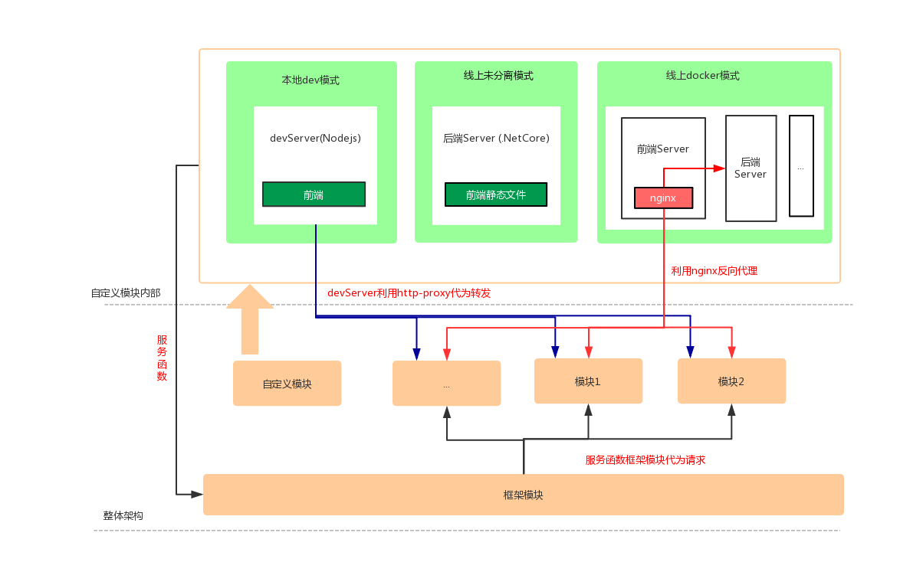

# Multiple pages based on vue-cli3.x

## Versions
### Multiple pages based on vue-cli3.x
[based on vue-cli3.x](https://github.com/sknightq/vue-mpc/tree/master)
### Multiple pages based on vue-cli2.x
[based on vue-cli2.x](https://github.com/sknightq/vue-mpc/tree/vue-cli2.x)

## Company Structure



## Description
Because of the update of the vue-cli, I upated my project. Thanks for the vue-cli3.x, I found that configuring the multiple pages was easier. However, since my company's structure, I added some custom settings.  

<details>
  <summary>想看中文！</summary>
  因为vue-cli的更新，我也更新了我的项目。感谢vue-cli3.x让多页面配置变得更简单了。但是由于我公司架构原因，我增加一些自定义的配置。  
</details>  

> 1. Add a new cli : `npm run site --name=[site-name]`, 'site-name' comes from in config/sites.config.js, default is 'dev'
> 2. In build/prebuild, I use the template of nginx config file (config/nginx.base.conf) to create a new configuration for production, which is deployed in docker
> 3. Add v-router for some entries, so these entries will become a single page with front-end router  
<details>
  <summary>想看中文！</summary>
  <p>1. 增加了一个新命令：npm run site --name=[site-name]，'site-name'来自 config/sites.config.js, 缺省的话就是'dev'</p>  
  <p>2. 在 build/prebuild中，我会利用nginx config模板(config/nginx.base.conf)来生成一个新的用于线上docker里的nginx.conf</p>   
  <p>3. 对于某些入口新增了v-router配置，实现多页面里某个入口单页面</p> 
</details>  

## Deploy(deploy files are not uploaded)  
#### 1. Static Files  
```
npm run site --name=[site-name]
```

#### 2. With Docker 
In 'cli' folder, there are two deploy files. One is for building a docker image. The other is for deploying the docker image to production environment if the environment is accessible (can use ssh command)
``` 
cd [project]
bash ./cli/pub_docker.sh
bash ./cli/deploy.sh
```

## Project setup
```
npm install
```

### Compiles and hot-reloads for development
```
npm run serve
```

### Compiles and minifies for production
```
npm run build
```
### Compiles and minifies for specified site
```
npm run site --name=[site-name]
```

### Run your tests
```
npm run test
```

### Lints and fixes files
```
npm run lint
```
## TODO List
- [x] add a demo
- [ ] add a image for company structure
- [x] remove unuseful file in demo
- [x] using Chinese
- [ ] modify my english syntax
- [ ] more detail
